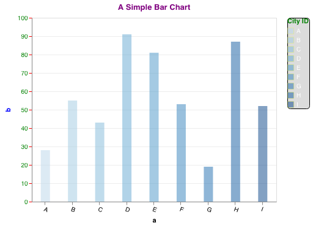
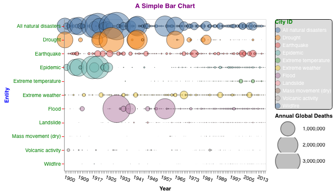

# Vega-Lite
##### The touching the iceberg of Vega-Lite

** Just for learn how it works, their overall color choice is a disaster. 
** (but visually reconiziable to see how each property works and 
     to know where to add them in the json structure)

* Simple Bar Chart
 
Reference from hre.(https://vega.github.io/vega-lite/examples/bar.html)
* Circle Natural Disasters
Reference from here. (https://vega.github.io/editor/#/examples/vega-lite/circle_natural_disasters)
 

(So far)
Pro:
1. Very interactive outcome, and keep its interactiveness while adding webpage!
2. Learning carve is high: easy to learn.
3. All parts are easily customizable, and flexible.
4. Online editor makes things much easier(https://vega.github.io/editor/#/edited)

Con:
1. Limiting to differentiate the color of each data pont.
